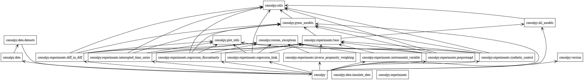

# Guidelines for Contributing

CausalPy welcomes contributions from interested individuals or groups. These guidelines are provided to give potential contributors information to make their contribution compliant with the conventions of the CausalPy project, and maximize the probability of such contributions are merged as quickly and efficiently as possible. Contributors need not be experts, but should be interested in the project, willing to learn, and share knowledge.

There are 4 main ways of contributing to the CausalPy project (in ascending order of difficulty or scope):

1. Submitting issues related to bugs or desired enhancements.
2. Contributing or improving the documentation (docs) or examples.
3. Fixing outstanding issues (bugs) with the existing codebase. They range from low-level software bugs to higher-level design problems.
4. Adding new or improved functionality to the existing codebase.

Items 2-4 require setting up a local development environment, see [Local development steps](#Local-development-steps) for more information.

## Opening issues

We appreciate being notified of problems with the existing CausalPy code. We prefer that issues be filed the on [Github Issue Tracker](https://github.com/pymc-labs/CausalPy/issues), rather than on social media or by direct email to the developers.

Please verify that your issue is not being currently addressed by other issues or pull requests by using the GitHub search tool to look for key words in the project issue tracker.

## Use of agents
PR's with agent-generated code are fine. But don't spam us with code you don't understand. See [AGENTS.md](./AGENTS.md) for how we use LLMs in this repo.

## Understanding the codebase architecture
If you're new to the CausalPy codebase or planning to make significant contributions, we strongly recommend reading [RESEARCH.md](./RESEARCH.md). This developer-oriented guide provides:

- An overview of the package architecture and how modules interact
- Details on core abstractions (`BaseExperiment`, `PyMCModel`, etc.)
- Public vs. internal API boundaries
- Step-by-step guides for adding new experiment designs or models
- Testing conventions and quality standards
- Known limitations and areas needing improvement

This document serves as a "map" of the codebase and will help you understand where your contributions fit in the overall architecture.

## Contributing code via pull requests

While issue reporting is valuable, we strongly encourage users who are inclined to do so to submit patches for new or existing issues via pull requests. This is particularly the case for simple fixes, such as typos or tweaks to documentation, which do not require a heavy investment of time and attention.

Contributors are also encouraged to contribute new code to enhance CausalPy's functionality, via pull requests.

The preferred workflow for contributing to CausalPy is to fork the GitHub repository, clone it to your local machine, and develop on a feature branch.

For more instructions see the [Pull request checklist](#pull-request-checklist)

## Local development steps

1. If you have not already done so, fork the [project repository](https://github.com/pymc-labs/CausalPy) by clicking on the 'Fork' button near the top right of the main repository page. This creates a copy of the code under your GitHub user account.

1. Clone your fork of the `CausalPy` repo from your GitHub account to your local disk, and add the base repository as a remote:

    ```bash
    git clone git@github.com:<your GitHub handle>/CausalPy.git
    cd CausalPy
    git remote add upstream git@github.com:pymc-labs/CausalPy.git
    ```

1. Create a feature branch (e.g. `my-feature`) to hold your development changes:

   ```bash
   git checkout -b my-feature
   ```

   Always use a feature branch. It's good practice to never routinely work on the `main` branch of any repository.

1. Create the environment from the `environment.yml` file.

    ```bash
    mamba env create -f environment.yml
    ```

    Activate the environment.

    ```bash
    conda activate CausalPy
    ```

    Install the package (in editable mode) and its development dependencies. The `--no-deps` flag is used to avoid installing the dependencies of `CausalPy` as they are already installed when installing the development dependencies. This can end up interfering with the conda-only install of pymc.

    ```bash
    pip install --no-deps -e .
    ```

	Install development dependencies

	```bash
	pip install 'causalpy[dev]'
	pip install 'causalpy[docs]'
	pip install 'causalpy[test]'
	pip install 'causalpy[lint]'
	pip install 'pylint'
	```

	It may also be necessary to [install](https://pandoc.org/installing.html) `pandoc`. On a mac, run `brew install pandoc`.

    Set [pre-commit hooks](https://pre-commit.com/)

    ```bash
    pre-commit install
    ```

	If you are editing or writing new examples in the form of Jupyter notebooks, you may have to run the following command to make Jupyter Lab aware of the `CausalPy` environment.

	```
	python -m ipykernel install --user --name CausalPy
	```

1. You can then work on your changes locally, in your feature branch. Add changed files using `git add` and then `git commit` files:

   ```bash
   git add modified_files
   git commit -m "Message summarizing commit changes"
   ```

   to record your changes locally.
   After committing, it is a good idea to sync with the base repository in case there have been any changes:

   ```bash
   git fetch upstream
   git rebase upstream/main
   ```

   Then push the changes to your GitHub account with:

   ```bash
   git push -u origin my-feature
   ```

1. Before you submit a Pull Request, follow the [Pull request checklist](#pull-request-checklist).

1. Finally, to submit a pull request, go to the GitHub web page of your fork of the CausalPy repo. Click the 'Pull request' button to send your changes to the project's maintainers for review. This will send an email to the committers.

## Pull request checklist

We recommend that your contribution complies with the following guidelines before you submit a pull request:

- If your pull request addresses an issue, please use the pull request title to describe the issue and mention the issue number in the pull request description. This will make sure a link back to the original issue is created.

- All public methods must have informative docstrings with sample usage when appropriate.

- Example usage in docstrings is tested via doctest, which can be run via

    ```bash
    make doctest
    ```

- Doctest can also be run directly via pytest, which can be helpful to run only specific tests during development. The following commands run all doctests, only doctests in the pymc_models module, and only the doctests for the `PyMCModel` class in pymc_models:

    ```bash
    pytest --doctest-modules causalpy/
    pytest --doctest-modules causalpy/pymc_models.py
    pytest --doctest-modules causalpy/pmyc_models.py::causalpy.pymc_models.PyMCModel
    ```

- To indicate a work in progress please mark the PR as `draft`. Drafts may be useful to (1) indicate you are working on something to avoid duplicated work, (2) request broad review of functionality or API, or (3) seek collaborators.

- All other tests pass when everything is rebuilt from scratch. Tests can be run with:

    ```bash
    make test
    ```

- When adding additional functionality, either edit an existing example, or create a new example (typically in the form of a Jupyter Notebook). Have a look at other examples for reference. Examples should demonstrate why the new functionality is useful in practice.

- Documentation and high-coverage tests are necessary for enhancements to be accepted.

- Documentation follows [NumPy style guide](https://numpydoc.readthedocs.io/en/latest/format.html)

- If you have changed the documentation, you should [build the docs locally](#Building-the-documentation-locally) and check that the changes look correct.

- Run any of the pre-existing examples in `CausalPy/docs/source/*` that contain analyses that would be affected by your changes to ensure that nothing breaks. This is a useful opportunity to not only check your work for bugs that might not be revealed by unit test, but also to show how your contribution improves CausalPy for end users.

- Your code passes linting tests. Run the line below to check linting errors:

  ```bash
  make check_lint
  ```
  If you want to fix linting errors automatically, run

  ```bash
  make lint
  ```

## Building the documentation locally

To build the documentation, run from the **project root**:

```bash
make html
```
To clean and rebuild the documentation from scratch:
```bash
make cleandocs
make html
```
 Docs are built in docs/_build/html, but these docs are not committed to the GitHub repository due to .gitignore.

 📌 Note: The previous docs/Makefile has been removed. Please use only the root-level Makefile for documentation commands

## Overview of code structure

Classes


Packages


UML diagrams can be created with the command below.

```bash
make uml
```

---

This guide takes some inspiration from the [Bambi guide to contributing](https://github.com/bambinos/bambi/blob/main/docs/CONTRIBUTING.md)
