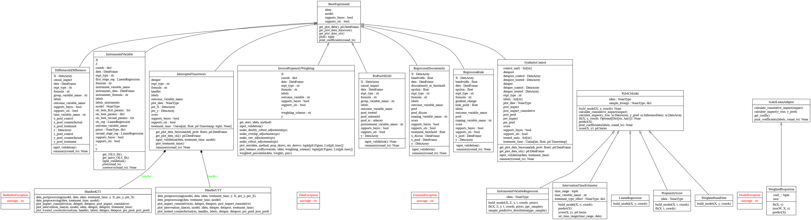

# Guidelines for Contributing

CausalPy welcomes contributions from interested individuals or groups. These guidelines are provided to give potential contributors information to make their contribution compliant with the conventions of the CausalPy project, and maximize the probability of such contributions are merged as quickly and efficiently as possible. Contributors need not be experts, but should be interested in the project, willing to learn, and share knowledge.

## Table of Contents

- [Quick Start](#quick-start)
- [Opening issues](#opening-issues)
- [Use of agents](#use-of-agents)
- [Contributing code via pull requests](#contributing-code-via-pull-requests)
- [Local development steps](#local-development-steps)
- [Pull request checklist](#pull-request-checklist)
- [Building the documentation locally](#building-the-documentation-locally)
- [Overview of code structure](#overview-of-code-structure)
- [Contributor pathways and permissions](#contributor-pathways-and-permissions)
  - [Current maintainers](#current-maintainers)
  - [Principles](#principles)
  - [Pathway overview](#pathway-overview)
  - [Levels in detail](#levels-in-detail)
  - [Decision process](#decision-process)
  - [Role expectations checklist](#role-expectations-checklist)
  - [Appendix: Quick rubric for promotion](#appendix-quick-rubric-for-promotion)

---

## Quick Start

After forking this repository on GitHub, get up and running in 4 commands:

```bash
git clone git@github.com:<your-github-handle>/CausalPy.git && cd CausalPy
mamba env create -f environment.yml
conda activate CausalPy
make setup  # Installs package + all dev dependencies + pre-commit hooks
```

Verify everything works:

```bash
make test
```

For the complete setup instructions, see [Local development steps](#local-development-steps).

---

There are 4 main ways of contributing to the CausalPy project (in ascending order of difficulty or scope):

1. Submitting issues related to bugs or desired enhancements.
2. Contributing or improving the documentation (docs) or examples.
3. Fixing outstanding issues (bugs) with the existing codebase. They range from low-level software bugs to higher-level design problems.
4. Adding new or improved functionality to the existing codebase.

Items 2-4 require setting up a local development environment, see [Local development steps](#Local-development-steps) for more information.

## Opening issues

We appreciate being notified of problems with the existing CausalPy code. We prefer that issues be filed the on [Github Issue Tracker](https://github.com/pymc-labs/CausalPy/issues), rather than on social media or by direct email to the developers.

Please verify that your issue is not being currently addressed by other issues or pull requests by using the GitHub search tool to look for key words in the project issue tracker.

## Use of agents
PR's with agent-generated code are fine. But don't spam us with code you don't understand. See [AGENTS.md](./AGENTS.md) for how we use LLMs in this repo.

## Contributing code via pull requests

While issue reporting is valuable, we strongly encourage users who are inclined to do so to submit patches for new or existing issues via pull requests. This is particularly the case for simple fixes, such as typos or tweaks to documentation, which do not require a heavy investment of time and attention.

Contributors are also encouraged to contribute new code to enhance CausalPy's functionality, via pull requests.

The preferred workflow for contributing to CausalPy is to fork the GitHub repository, clone it to your local machine, and develop on a feature branch.

For more instructions see the [Pull request checklist](#pull-request-checklist)

## Local development steps

1. If you have not already done so, fork the [project repository](https://github.com/pymc-labs/CausalPy) by clicking on the 'Fork' button near the top right of the main repository page. This creates a copy of the code under your GitHub user account.

1. Clone your fork of the `CausalPy` repo from your GitHub account to your local disk, and add the base repository as a remote:

    ```bash
    git clone git@github.com:<your GitHub handle>/CausalPy.git
    cd CausalPy
    git remote add upstream git@github.com:pymc-labs/CausalPy.git
    ```

1. Create a feature branch (e.g. `my-feature`) to hold your development changes:

   ```bash
   git checkout -b my-feature
   ```

   Always use a feature branch. It's good practice to never routinely work on the `main` branch of any repository.

1. Create the environment from the `environment.yml` file and activate it:

    ```bash
    mamba env create -f environment.yml
    conda activate CausalPy
    ```

1. Install the package and all development dependencies using the automated setup:

    ```bash
    make setup
    ```

    This single command:
    - Installs CausalPy in editable mode (with `--no-deps` to avoid conflicts with conda-installed PyMC)
    - Installs all development extras (`dev`, `docs`, `test`, `lint`)
    - Sets up pre-commit hooks

    It may also be necessary to [install](https://pandoc.org/installing.html) `pandoc`. On a Mac, run `brew install pandoc`.

	If you are editing or writing new examples in the form of Jupyter notebooks, you may have to run the following command to make Jupyter Lab aware of the `CausalPy` environment.

	```bash
	python -m ipykernel install --user --name CausalPy
	```

1. You can then work on your changes locally, in your feature branch. Add changed files using `git add` and then `git commit` files:

   ```bash
   git add modified_files
   git commit -m "Message summarizing commit changes"
   ```

   to record your changes locally.
   After committing, it is a good idea to sync with the base repository in case there have been any changes:

   ```bash
   git fetch upstream
   git rebase upstream/main
   ```

   Then push the changes to your GitHub account with:

   ```bash
   git push -u origin my-feature
   ```

1. Before you submit a Pull Request, follow the [Pull request checklist](#pull-request-checklist).

1. Finally, to submit a pull request, go to the GitHub web page of your fork of the CausalPy repo. Click the 'Pull request' button to send your changes to the project's maintainers for review. This will send an email to the committers.

## Pull request checklist

We recommend that your contribution complies with the following guidelines before you submit a pull request:

- If your pull request addresses an issue, please use the pull request title to describe the issue and mention the issue number in the pull request description. This will make sure a link back to the original issue is created.

- All public methods must have informative docstrings with sample usage when appropriate.

- Example usage in docstrings is tested via doctest, which can be run via

    ```bash
    make doctest
    ```

- Doctest can also be run directly via pytest, which can be helpful to run only specific tests during development. The following commands run all doctests, only doctests in the pymc_models module, and only the doctests for the `PyMCModel` class in pymc_models:

    ```bash
    pytest --doctest-modules causalpy/
    pytest --doctest-modules causalpy/pymc_models.py
    pytest --doctest-modules causalpy/pmyc_models.py::causalpy.pymc_models.PyMCModel
    ```

- To indicate a work in progress please mark the PR as `draft`. Drafts may be useful to (1) indicate you are working on something to avoid duplicated work, (2) request broad review of functionality or API, or (3) seek collaborators.

- All other tests pass when everything is rebuilt from scratch. Tests can be run with:

    ```bash
    make test
    ```

- When adding additional functionality, either edit an existing example, or create a new example (typically in the form of a Jupyter Notebook). Have a look at other examples for reference. Examples should demonstrate why the new functionality is useful in practice.

- Documentation and high-coverage tests are necessary for enhancements to be accepted.

- Documentation follows [NumPy style guide](https://numpydoc.readthedocs.io/en/latest/format.html)

- If you have changed the documentation, you should [build the docs locally](#Building-the-documentation-locally) and check that the changes look correct.

- Run any of the pre-existing examples in `CausalPy/docs/source/*` that contain analyses that would be affected by your changes to ensure that nothing breaks. This is a useful opportunity to not only check your work for bugs that might not be revealed by unit test, but also to show how your contribution improves CausalPy for end users.

- Your code passes linting tests. Run the line below to check linting errors:

  ```bash
  make check_lint
  ```
  If you want to fix linting errors automatically, run

  ```bash
  make lint
  ```

## Building the documentation locally

To build the documentation, run from the **project root**:

```bash
make html
```
To clean and rebuild the documentation from scratch:
```bash
make cleandocs
make html
```
 Docs are built in docs/_build/html, but these docs are not committed to the GitHub repository due to .gitignore.

 📌 Note: The previous docs/Makefile has been removed. Please use only the root-level Makefile for documentation commands

## Overview of code structure

Classes


Packages


UML diagrams can be created with the command below.

```bash
make uml
```

---

## Contributor pathways and permissions

Contributions are welcome from the community. This section describes how contributors can grow their responsibilities in the CausalPy project and the GitHub permissions that come with each level.

### Current maintainers

<!-- Update this list as the team evolves -->
- [@drbenvincent](https://github.com/drbenvincent)
- [@juanitorduz](https://github.com/juanitorduz)
- [@NathanielF](https://github.com/NathanielF)
- [@lucianopaz](https://github.com/lucianopaz)

### Principles

- **Earned trust, least privilege:** permissions increase gradually as trust is built.
- **Transparency:** criteria and expectations are clear and applied consistently.
- **Sustainability:** pathways should reduce maintainer load over time.
- **Safety by default:** branch protection and CI checks remain in place regardless of role.
- **Respect:** all contributions (code and non-code) are valued.

### Pathway overview

| Level | GitHub permission | Typical scope | Primary focus |
|---|---|---|---|
| Community participant | N/A | Participate via issues, discussions, and PRs from forks | Reporting, ideas, fixes, docs, examples, tests |
| Triager | Triage | Manage issues/PRs (no write) | Labels, reproductions, routing, housekeeping |
| Collaborator | Write | Contribute directly to branches | Regular PRs, reviews, maintenance |
| Maintainer | Maintain | Manage repository operations | Merging, releases, governance, roadmap |

> Note: Titles are descriptive. GitHub permission is the enforceable access level.

### Levels in detail

#### 1) Community participant (public access)

**Who this is for**
- Anyone engaging with the project: users, researchers, educators, and prospective contributors.

**What you can do**
- Open issues (bug reports, feature requests, questions).
- Participate in discussions.
- Submit PRs from forks (code, docs, tests, examples).
- Review PRs by leaving comments and suggestions.

**Expectations**
- Follow the [Code of Conduct](https://www.contributor-covenant.org/version/2/1/code_of_conduct/).
- Prefer small, focused PRs.
- Include tests and docs updates when appropriate.
- Be responsive to reviewer feedback.

**Signals you may be ready for elevated access**
- Consistently helpful participation and good judgment.
- High-quality issue reports (clear repro, version info).
- A track record of merged contributions and constructive reviews.

---

#### 2) Triager (Triage)

**Who this is for**
- Contributors who help maintain project hygiene by managing issues and PR flow without changing code directly.

**What you can do (typical)**
- Apply and manage labels.
- Ask for reproductions, logs, environment details.
- Close duplicates, redirect questions to Discussions.
- Keep PRs moving by requesting changes, tagging reviewers, and nudging for updates.

**What you cannot do**
- Merge PRs.
- Change repository settings.

**Expectations**
- Use a consistent labeling taxonomy.
- Be neutral and kind; focus on clarity.
- Escalate ambiguous/controversial decisions to maintainers.

**Suggested criteria**
- Demonstrated helpfulness over time (e.g., 4–8 weeks of consistent triage activity).
- Sound judgment on duplicates, scope, and priority.

**Nomination and granting**
- Maintainers can invite directly, or a contributor can request the role by [opening a GitHub issue](https://github.com/pymc-labs/CausalPy/issues/new).
- Access is reviewed periodically; inactivity may result in stepping down.

---

#### 3) Collaborator (Write)

**Who this is for**
- Contributors who actively push changes and can be trusted with direct write access.

**What you can do (typical)**
- Push branches to the main repository.
- Help maintain CI, docs, examples.
- Perform routine maintenance tasks (refactors, dependency updates) within agreed scope.

**Expectations**
- Demonstrate good engineering hygiene: tests, docs, changelog discipline (as applicable).
- Respect backwards compatibility and public API stability.
- Participate in code review (both giving and receiving).

**Suggested criteria**
- Sustained contributions (e.g., multiple merged PRs across at least a few weeks/months).
- High-quality reviews that improve code quality and catch issues.
- Familiarity with project standards and tooling.

**Safety mechanisms**
- Branch protection remains enabled (required checks, review requirements).
- Prefer PR-based changes even for collaborators.

---

#### 4) Maintainer (Maintain)

**Who this is for**
- People who help run the project: merging, release coordination, and repository management.

**What you can do (typical)**
- Merge PRs.
- Manage labels and milestones.
- Coordinate releases and ensure release notes are accurate.
- Manage project boards (if used).

**Expectations**
- Consistent review and merge quality.
- Ability to mediate disagreements and drive decisions.
- Active stewardship of community norms.

**Suggested criteria**
- Track record of high-impact contributions and reliable collaboration.
- Demonstrated leadership: mentoring, reviews, triage, roadmap contributions.
- Comfortable with responsible disclosure and security processes (if applicable).

**Onboarding**
- Start with a limited scope (e.g., one module or docs/releases) and expand.

---

### Decision process

#### How people are invited
- A maintainer opens a short nomination discussion (or uses an internal maintainer thread) referencing:
  - contributions (PRs/issues/reviews)
  - areas of ownership
  - proposed permission level
- After a short review period, maintainers grant access.

#### Resolving disagreements
- Decisions are made by informal consensus among maintainers.
- If consensus cannot be reached, a simple majority decides.
- For project-wide decisions (e.g., major API changes, new maintainers), give at least one week for async discussion before finalizing.

#### How to step down
- Anyone can request to step down at any time.
- Access can be reduced after long inactivity to minimize risk.

#### A note on Admin access
Admin access is reserved for project leads and is not part of the contributor pathway. Admins handle repository settings, secrets, and GitHub Actions configuration.

### Role expectations checklist

- Communicate clearly and respectfully.
- Default to PR-based workflows.
- Keep changes small and reviewable.
- Prefer documenting decisions in issues/PRs.

### Appendix: Quick rubric for promotion

Consider promoting when a contributor reliably demonstrates:
- **Quality:** produces correct changes with appropriate tests/docs.
- **Judgment:** scopes work well and respects compatibility.
- **Collaboration:** responds to review, helps others, communicates.
- **Consistency:** shows up over time rather than one-off activity.

---

This guide takes some inspiration from the [Bambi guide to contributing](https://github.com/bambinos/bambi/blob/main/docs/CONTRIBUTING.md)
