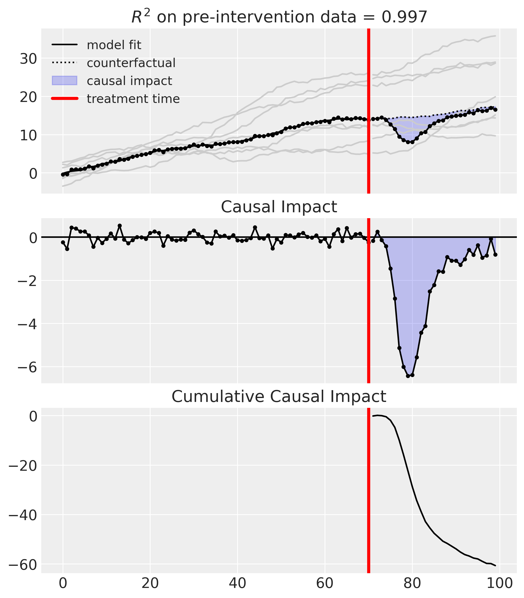
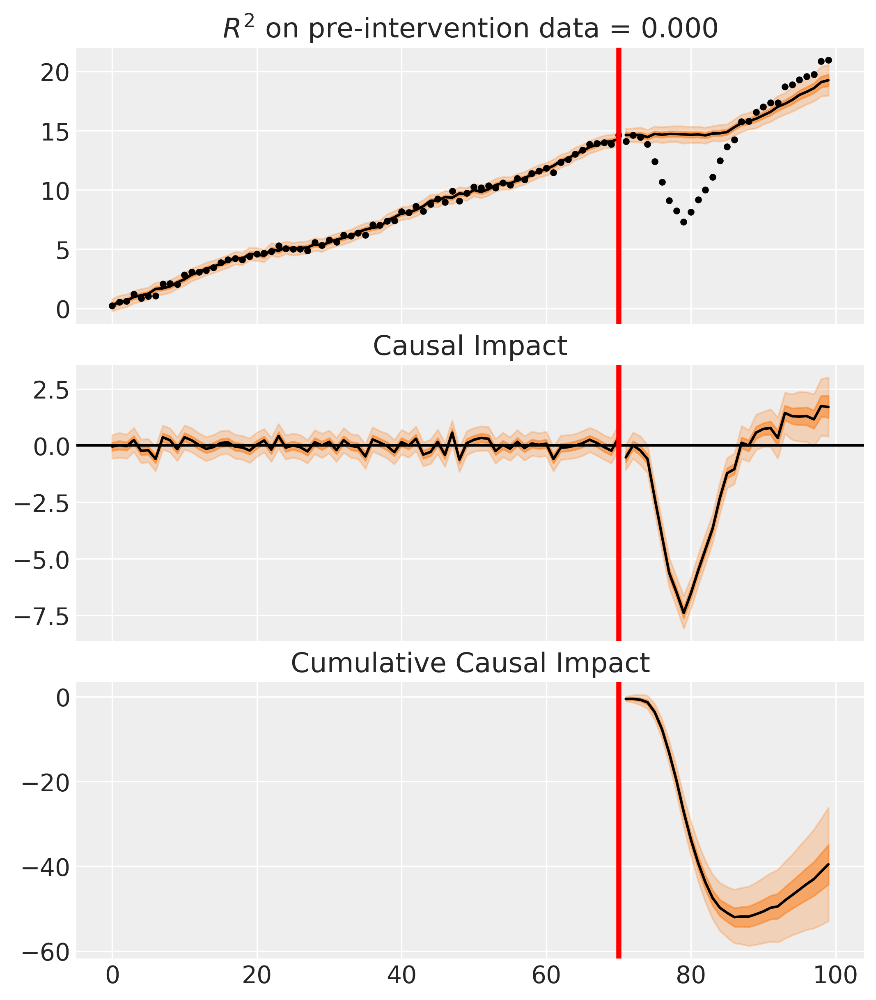
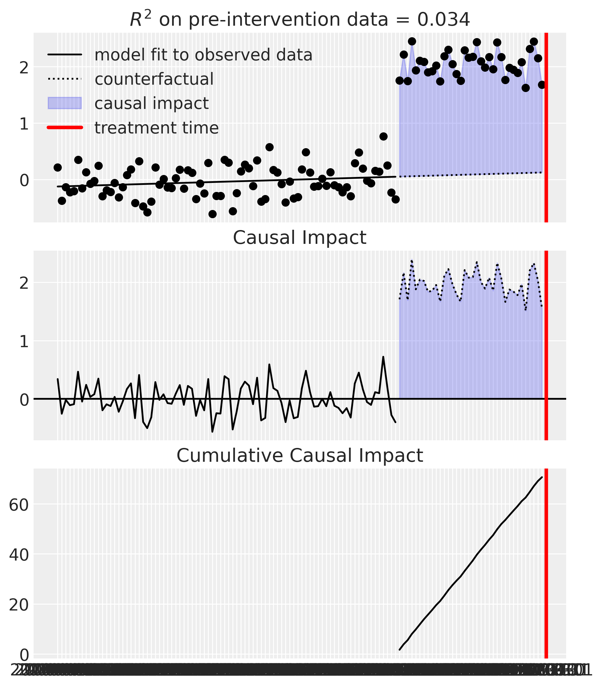
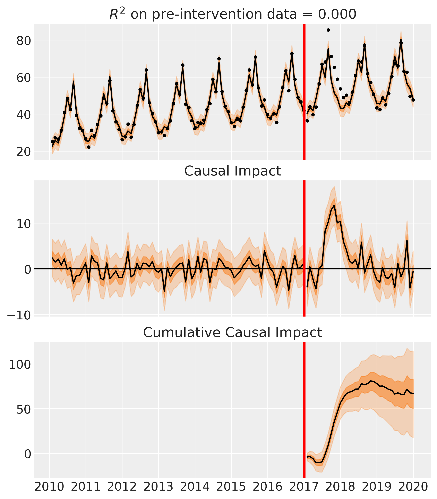
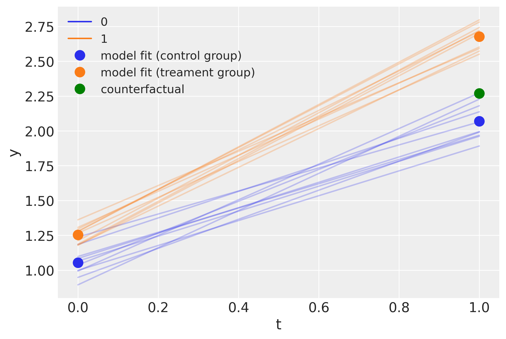
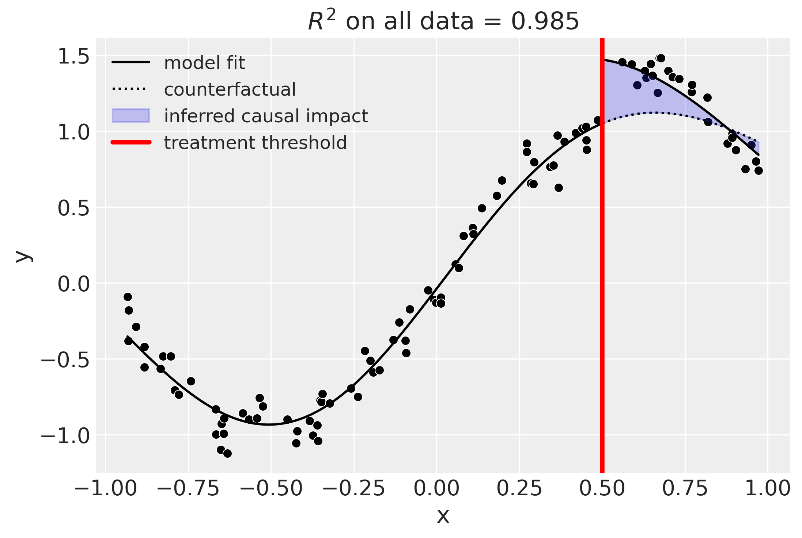
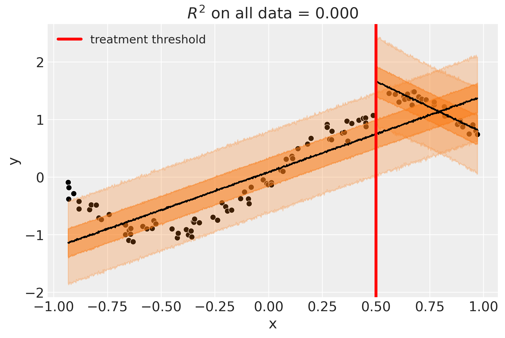

# CausalPy

A Python package focussing on causal inference in quasi-experimental settings. The package allows for both traditional OLS and Bayesian model fitting methods to be used.

_**STATUS:** Feel free to explore and experiment with the repository, and we very much welcome feedback (via [Issues](https://github.com/pymc-labs/causal-inference/issues)). But be aware that this code is very alpha! Expect the codebase and API to change for a while, so it is not appropriate to rely on this package for in-production or research pipelines._ 

## Comparison to related packages

Rather than focussing on one particular quasi-experimental setting, this package aims to have broad applicability.

Another distinctive feature of this package is the ability to use different models. Currently, users can fit with `scikit-learn` models (see the [`scikit-learn` demo notebook](notebooks/skl_demos.ipynb)) or Bayesian models with `PyMC` (see the [`pymc` demo notebook](notebooks/pymc_demos.ipynb)).

|                           | [CausalImpact](https://google.github.io/CausalImpact/) from Google | [GeoLift](https://github.com/facebookincubator/GeoLift/) from Meta | QuasPy from [PyMC Labs](https://www.pymc-labs.io) |
|---------------------------|--------------------------------|---------|----------------------------------------|
| Interrupted time series   | ✅                              | ❌       | ✅                                      |
| Synthetic control         | ❌                              | ✅       | ✅                                      |
| Regression discontinuity  | ❌                              | ❌       | ✅                                      |
| Difference in differences | ❌                              | ❌       | ✅                                      |
| Language                  | R (but see [tfcausalimpact](https://github.com/WillianFuks/tfcausalimpact))  | R       | Python                                 |
| Models                    | Bayesian structural timeseries | Augmented synthetic control      | Flexible: Traditional OLS and Bayesian models |

## Installation

[coming soon]

## Roadmap

Plans for the repository can be seen in the [Issues](https://github.com/pymc-labs/causal-inference/issues). 

In addition to the quasi-experimental methods supported thus far, we might add functionality around propensity scores and non-equivalent group designs.

Currently we have a few core examples (see the [`scikit-learn` demo notebook](notebooks/skl_demos.ipynb) and the [`pymc` demo notebook](notebooks/pymc_demos.ipynb)) but we plan to flesh these out with more experiment and model variants over time.

## Overview of package capabilities

### Synthetic control
This is appropriate when you have multiple units, one of which is treated. You build a synthetic control as a weighted combination of the untreated units.

| Time | Outcome   | Control 1 | Control 2 | Control 3 |
|------|-----------|-----------|-----------|-----------|
| 0    | $y_0$ | $x_{1,0}$ | $x_{2,0}$ | $x_{3,0}$ |
| 1    | $y_1$ | $x_{1,1}$ | $x_{2,1}$ | $x_{3,1}$ |
|$\ldots$ | $\ldots$  | $\ldots$  | $\ldots$  | $\ldots$  |
| T    | $y_T$ | $x_{1,T}$ | $x_{2,T}$ | $x_{3,T}$ |

A worked example is given in the [Synthetic control](notebooks/synthetic_control.ipynb) notebook.

| Frequentist | Bayesian |
|--|--|
|  |  | 

### Interrupted time series
This is appropriate when you have a single treated unit, and therefore a single time series, and do _not_ have a set of untreated units.

| Time | Outcome |
|------|-----------|
| 0    | $y_0$ |
| 1    | $y_1$ |
|$\ldots$ | $\ldots$  |
| T    | $y_T$ |

A worked example is given in the [Interrupted time series](notebooks/interrupted_time_series_no_predictors.ipynb) notebook.

| Frequentist | Bayesian |
|--|--|
|  |  |

### Difference in Differences

This is appropriate when you have a single pre and post intervention measurement and have a treament and a control group.

Data is expected to be in the following form. Shown are just two units - one in the treated group (`group=1`) and one in the untreated group (`group=0`), but there can of course be multiple units per group. This is panel data (also known as repeated measures) where each unit is measured at 2 time points.

| Unit | Time | Group | Outcome         |
|------|---|-------|-----------|
| 0    | 0 | 0     | $y_{0,0}$ |
| 0    | 1 | 0     | $y_{0,0}$ |
| 1    | 0 | 1     | $y_{1,0}$ |
| 1    | 1 | 1     | $y_{1,1}$ |



### Regression discontinuity designs

Regression discontinuity designs are used when treatment is applied to units according to a cutoff on the running variable (e.g. $x$) which is typically _not_ time. By looking for the presence of a discontinuity at the precise point of the treatment cutoff then we can make causal claims about the potential impact of the treatment.

| Running variable | Outcome | Treated  |
|-----------|-----------|----------|
| $x_0$     | $y_0$     | False    |
| $x_1$     | $y_0$     | False    |
| $\ldots$  | $\ldots$  | $\ldots$ |
| $x_{N-1}$ | $y_{N-1}$ | True     |
| $x_N$     | $y_N$     | True     |


| Frequentist | Bayesian |
|--|--|
|  |  | 

## Learning resources

Here are some general resources about causal inference:

* The official [PyMC examples gallery](https://www.pymc.io/projects/examples/en/latest/gallery.html) has a set of examples specifically relating to causal inference.
* Angrist, J. D., & Pischke, J. S. (2009). Mostly harmless econometrics: An empiricist's companion. Princeton university press.
* Angrist, J. D., & Pischke, J. S. (2014). Mastering'metrics: The path from cause to effect. Princeton university press.
* Cunningham, S. (2021). [Causal inference: The Mixtape](https://mixtape.scunning.com). Yale University Press.
* Huntington-Klein, N. (2021). [The effect: An introduction to research design and causality](https://theeffectbook.net). Chapman and Hall/CRC.
* Reichardt, C. S. (2019). Quasi-experimentation: A guide to design and analysis. Guilford Publications.

## Contributions

This repository is under active development by a small number of contributors at the moment. Once the code and API has settled a bit we will open up and welcome contributions. But not yet.

## Licence

[Apache License](LICENSE)

--- 

## Local development

1. Create conda environment:

```bash
conda create --name causal_impact_env --file requirements.txt
```

2. Activate environment:

```bash
conda activate causal_impact_env
```

3. Import the package

```bash
pip install -e ./
```