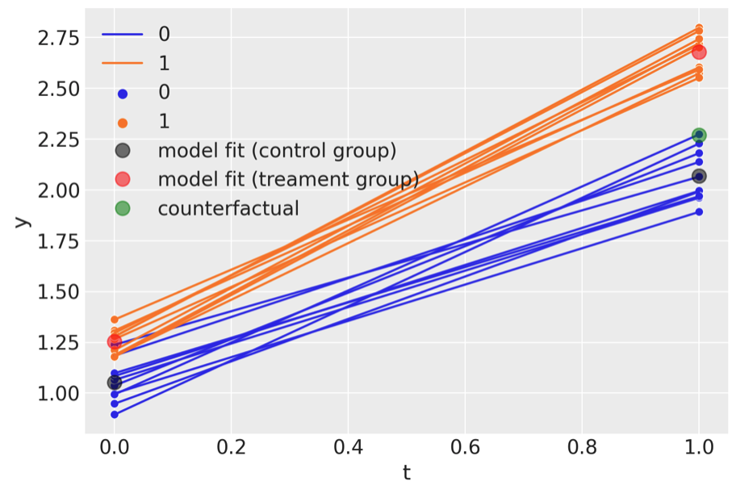

# [this repo name is to be decided!]

This package focusses on Bayesian causal inference

## Synthetic control
This is appropriate when you have multiple units, one of which is treated. You build a synthetic control as a weighted combination of the untreated units.

| time | Treatment | Control 1 | Control 2 | Control 3 |
|------|-----------|-----------|-----------|-----------|
| 0    | $y_0$ | $x_{1,0}$ | $x_{2,0}$ | $x_{3,0}$ |
| 1    | $y_1$ | $x_{1,1}$ | $x_{2,1}$ | $x_{3,1}$ |
|$\ldots$ | $\ldots$  | $\ldots$  | $\ldots$  | $\ldots$  |
| N    | $y_N$ | $x_{1,N}$ | $x_{2,N}$ | $x_{3,N}$ |

A worked example is given in the [Synthetic control](notebooks/synthetic_control.ipynb) notebook.


## Interrupted time series
This is appropriate when you have a single treated unit, and therefore a single time series, and do _not_ have a set of untreated units.

| time | Treatment |
|------|-----------|
| 0    | $y_0$ |
| 1    | $y_1$ |
|$\ldots$ | $\ldots$  |
| N    | $y_N$ |

A worked example is given in the [Interrupted time series](notebooks/interrupted_time_series_no_predictors.ipynb) notebook.


## Difference in Differences

Data is expected to be in the following form. Shown are just two units, one in the treated group (`group=1`) and one in the untreated group (`group=0`), but there can of course be multiple units per group. This is panel data (also known as repeated measures) where each unit is measured at 2 time points.

| unit | t | group | y         |
|------|---|-------|-----------|
| 0    | 0 | 0     | $y_{0,0}$ |
| 0    | 1 | 0     | $y_{0,0}$ |
| 1    | 0 | 1     | $y_{1,0}$ |
| 1    | 1 | 1     | $y_{1,1}$ |

This is appropriate when you have a single pre and post intervention measurement and have a treament and a control group.



## Related packages

* [CausalImpact](https://google.github.io/CausalImpact/) from Google
* [tfcausalimpact](https://github.com/WillianFuks/tfcausalimpact)
* [GeoLift](https://github.com/facebookincubator/GeoLift/) by Meta


## Learning resources

Here are some general resources about causal inference:

* The official [PyMC examples gallery](https://www.pymc.io/projects/examples/en/latest/gallery.html) has a set of examples specifically relating to causal inference.
* Huntington-Klein, N. (2021). [The effect: An introduction to research design and causality](https://theeffectbook.net). Chapman and Hall/CRC.
* Cunningham, S. (2021). [Causal inference: The Mixtape](https://mixtape.scunning.com). Yale University Press.

--- 

## Local development

1. Create conda environment:

```bash
conda create --name causal_impact_env --file requirements.txt
```

2. Activate environment:

```bash
conda activate causal_impact_env
```

3. Import the package

```bash
pip install -e ./
```