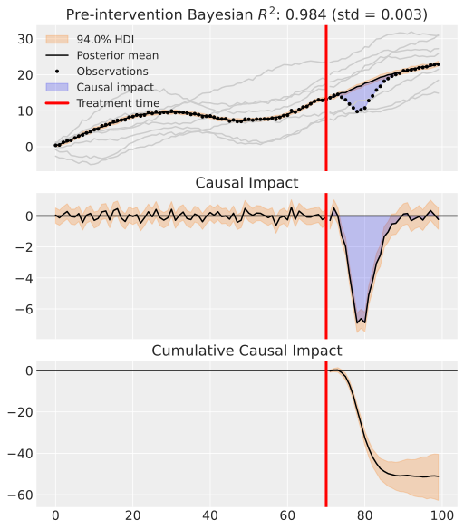
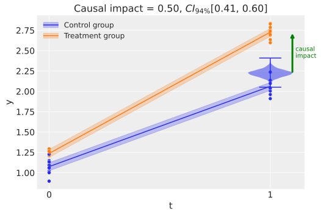
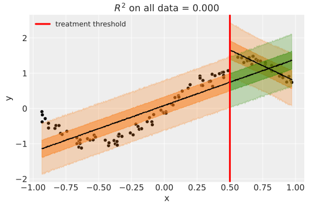

.. CausalPy documentation master file, created by
   sphinx-quickstart on Mon Nov 14 18:28:13 2022.
   You can adapt this file completely to your liking, but it should at least
   contain the root `toctree` directive.

CausalPy - causal inference for quasi-experiments
=================================================

A Python package focussing on causal inference for quasi-experiments. The package allows users to use different model types. Sophisticated Bayesian methods can be used, harnessing the power of `PyMC <https://www.pymc.io/>`_ and `ArviZ <https://python.arviz.org>`_. But users can also use more traditional `Ordinary Least Squares <https://en.wikipedia.org/wiki/Ordinary_least_squares>`_ estimation methods via `scikit-learn <https://scikit-learn.org/>`_ models.

Installation
------------

To get the latest release:

.. code-block:: sh

   pip install CausalPy

Alternatively, if you want the very latest version of the package you can install from GitHub:

.. code-block:: sh

   pip install git+https://github.com/pymc-labs/CausalPy.git

Quickstart
----------

.. code-block:: python

   from causalpy.pymc_experiments import RegressionDiscontinuity
   from causalpy.pymc_models import LinearRegression
   import pandas as pd
   import pathlib

   # Import and process data
   rd_data_path = pathlib.Path.cwd().parents[1] / "causalpy" / "data" / "drinking.csv"
   df = (
      pd.read_csv(rd_data_path)[["agecell", "all", "mva", "suicide"]]
      .rename(columns={"agecell": "age"})
      .assign(treated=lambda df_: df_.age > 21)
      .dropna(axis=0)
      )

   # Run the analysis
   result = RegressionDiscontinuity(
      df,
      formula="all ~ 1 + age + treated",
      running_variable_name="age",
      prediction_model=LinearRegression(),
      treatment_threshold=21,
      )

   # Visualize outputs
   fig, ax = result.plot();

   # Get a results summary
   result.summary()

Features
--------

Different quasi-experimental methods
^^^^^^^^^^^^^^^^^^^^^^^^^^^^^^^^^^^^

Rather than focussing on one particular quasi-experimental setting, this package aims to have broad applicability. We can analyse data from the following quasi-experimental methods:

Synthetic control
"""""""""""""""""

This is appropriate when you have multiple units, one of which is treated. You build a synthetic control as a weighted combination of the untreated units.

Difference in differences
"""""""""""""""""""""""""

This is appropriate when you have a single pre and post intervention measurement and have a treament and a control group.

Regression discontinuity
""""""""""""""""""""""""

Regression discontinuity designs are used when treatment is applied to units according to a cutoff on a running variable, which is typically not time. By looking for the presence of a discontinuity at the precise point of the treatment cutoff then we can make causal claims about the potential impact of the treatment.

Support
-------

This repository is supported by `PyMC Labs <https://www.pymc-labs.io>`_.

Documentation outline
=====================

.. toctree::
   :caption: Examples
   :titlesonly:

   examples

.. toctree::
   :caption: API Reference
   :titlesonly:

   api_skl_experiments
   api_skl_models
   api_pymc_experiments
   api_pymc_models
   api_plot_utils

Index
=====

* :ref:`genindex`
