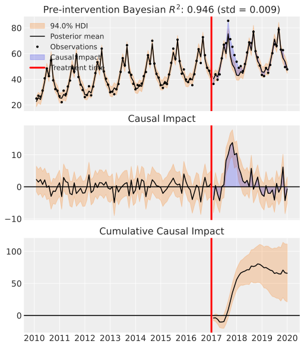

.. CausalPy documentation master file, created by
   sphinx-quickstart on Mon Nov 14 18:28:13 2022.
   You can adapt this file completely to your liking, but it should at least
   contain the root `toctree` directive.

CausalPy - causal inference for quasi-experiments
=================================================

A Python package focussing on causal inference for quasi-experimentas. The package allows users to use different model types. Sophisticated Bayesian methods can be used, harnessing the power of `PyMC <https://www.pymc.io/>`_ and `ArviZ <https://python.arviz.org>`_. But users can also use more traditional `Ordinary Least Squares <https://en.wikipedia.org/wiki/Ordinary_least_squares>`_ estimation methods via `scikit-learn <https://scikit-learn.org/>`_ models.

Installation
------------

To get the latest release:

.. code-block:: sh

   pip install CausalPy

Alternatively, if you want the very latest version of the package you can install from GitHub:

.. code-block:: sh

   pip install git+https://github.com/pymc-labs/CausalPy.git

Features
--------

Different quasi-experimental methods
^^^^^^^^^^^^^^^^^^^^^^^^^^^^^^^^^^^^

Rather than focussing on one particular quasi-experimental setting, this package aims to have broad applicability. We can analyse data from the following quasi-experimental methods:

Synthetic control
"""""""""""""""""

.. image:: ../img/synthetic_control_pymc.svg

Interrupted time series
"""""""""""""""""""""""

Difference in differences
"""""""""""""""""""""""""

.. image:: ../img/difference_in_differences_pymc.svg

Regression discontinuity
""""""""""""""""""""""""

.. image:: ../img/regression_discontinuity_pymc.svg

Support
-------

This repository is supported by `PyMC Labs <https://www.pymc-labs.io>`_.

.. image:: ../img/pymc-labs-log.png
   :align: center
   :target: https://www.pymc-labs.io
   :scale: 50 %

Documentation outline
=====================

.. toctree::
   :caption: Examples
   :titlesonly:

   examples

.. toctree::
   :caption: API Reference
   :titlesonly:

   api_skl_experiments
   api_skl_models
   api_pymc_experiments
   api_pymc_models
   api_plot_utils

Index
=====

* :ref:`genindex`
