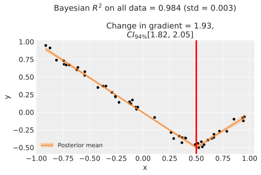
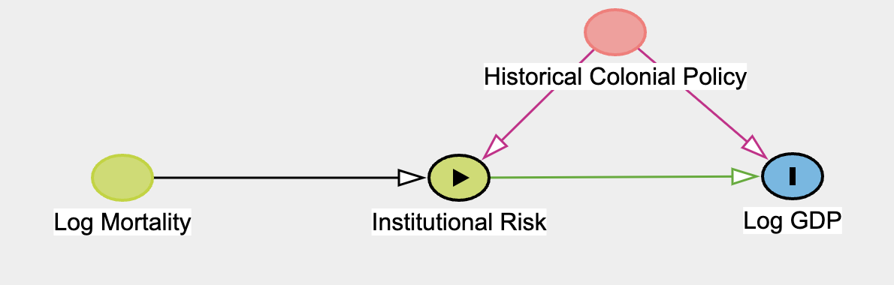
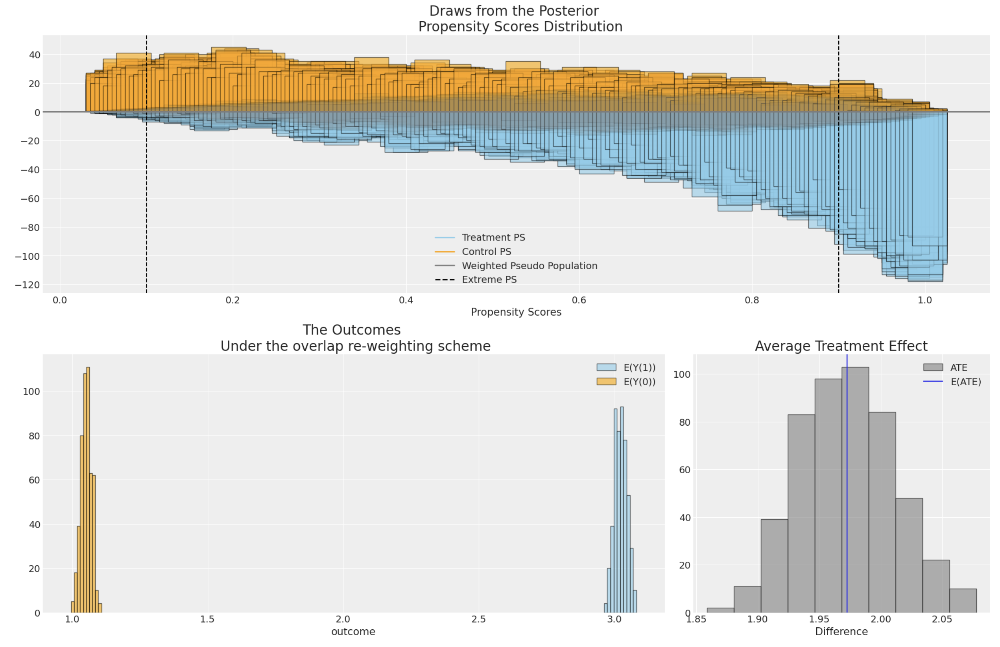

:::{image} _static/logo.png
:width: 60 %
:align: center
:alt: CausalPy logo
:::

# CausalPy - causal inference for quasi-experiments

A Python package focussing on causal inference for quasi-experiments. The package allows users to use different model types. Sophisticated Bayesian methods can be used, harnessing the power of [PyMC](https://www.pymc.io/>) and [ArviZ](https://python.arviz.org). But users can also use more traditional [Ordinary Least Squares](https://en.wikipedia.org/wiki/Ordinary_least_squares) estimation methods via [scikit-learn](https://scikit-learn.org) models.

## Installation

To get the latest release you can use pip:

```bash
   pip install CausalPy
```

or conda:

```bash
   conda install causalpy -c conda-forge
```

Alternatively, if you want the very latest version of the package you can install from GitHub:

```bash
   pip install git+https://github.com/pymc-labs/CausalPy.git
```

## Quickstart

```python

   import causalpy as cp
   import matplotlib.pyplot as plt


   # Import and process data
   df = (
      cp.load_data("drinking")
      .rename(columns={"agecell": "age"})
      .assign(treated=lambda df_: df_.age > 21)
      )

   # Run the analysis
   result = cp.RegressionDiscontinuity(
      df,
      formula="all ~ 1 + age + treated",
      running_variable_name="age",
      model=cp.pymc_models.LinearRegression(),
      treatment_threshold=21,
      )

   # Visualize outputs
   fig, ax = result.plot();

   # Get a results summary
   result.summary()

   plt.show()
```

## Videos

<style>
.video-container {
    position: relative;
    padding-bottom: 56.25%; /* 16:9 aspect ratio */
    height: 0;
    overflow: hidden;
    max-width: 100%;
    background: #000;
}

.video-container iframe {
    position: absolute;
    top: 0;
    left: 0;
    width: 100%;
    height: 100%;
    border: 0;
}
</style>

<div class="video-container">
    <iframe src="https://www.youtube.com/embed/gV6wzTk3o1U" title="YouTube video player" allow="accelerometer; autoplay; clipboard-write; encrypted-media; gyroscope; picture-in-picture; web-share" allowfullscreen></iframe>
</div>

## Features

Rather than focussing on one particular quasi-experimental setting, this package aims to have broad applicability. We can analyse data from the following quasi-experimental methods:

### Synthetic control

This is appropriate when you have multiple units, one of which is treated. You build a synthetic control as a weighted combination of the untreated units.


### Geographical Lift / Geolift
We can also use synthetic control methods to analyse data from geographical lift studies. For example, we can try to evaluate the causal impact of an intervention (e.g. a marketing campaign) run in one geographical area by using control geographical areas which are similar to the intervention area but which did not recieve the specific marketing intervention.

### ANCOVA

This is appropriate when you have a single pre and post intervention measurement and have a treament and a control group.


### Difference in differences

This is appropriate when you have pre and post intervention measurement(s) and have a treament and a control group.


### Regression discontinuity

Regression discontinuity designs are used when treatment is applied to units according to a cutoff on a running variable, which is typically not time. By looking for the presence of a discontinuity at the precise point of the treatment cutoff then we can make causal claims about the potential impact of the treatment.


### Regression kink designs

Regression kink designs are used when there is a change in the level of treatment at a "kink point" on a running variable, which is typically not time. By looking for the presence of a discontinuity in the gradient at the kink point then we can make causal claims about the potential impact of changes in the treatment.



### Interrupted time series
Interrupted time series analysis is appropriate when you have a time series of observations which undergo treatment at a particular point in time. This kind of analysis has no control group and looks for the presence of a change in the outcome measure at or soon after the treatment time.


### Instrumental Variable Regression
Instrumental Variable regression is an appropriate technique when you wish to estimate the treatment effect of some variable on another, but are concerned that the treatment variable is endogenous in the system of interest i.e. correlated with the errors. In this case an "instrument" variable can be used in a regression context to disentangle treatment effect due to the threat of confounding due to endogeneity.



### Inverse Propensity Score Weighting
Inverse Propensity Score Weighting is a technique used to correct selection effects in observational data by re-weighting observations to better reflect an as-if random allocation to treatment status. This helps recover unbiased causal effect estimates.



## Support

This repository is supported by [PyMC Labs](https://www.pymc-labs.io).

For companies that want to use CausalPy in production, [PyMC Labs](https://www.pymc-labs.com) is available for consulting and training. We can help you build and deploy your models in production. We have experience with cutting edge Bayesian and causal modelling techniques which we have applied to a range of business domains.

<p align="center">
  <a href="https://www.pymc-labs.io">
    
  </a>
</p>

:::{toctree}
:hidden:

knowledgebase/index
api/index
notebooks/index
:::
