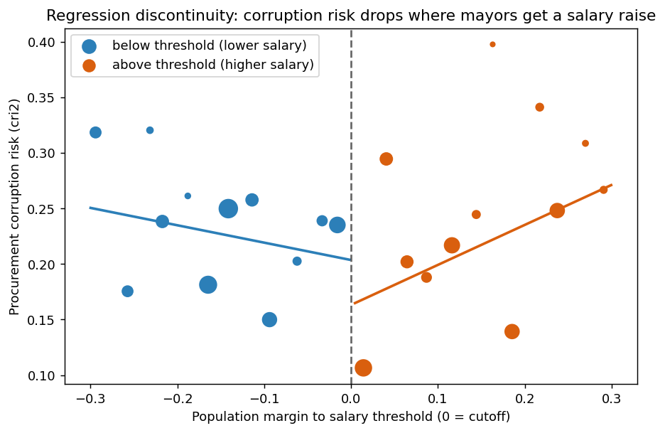
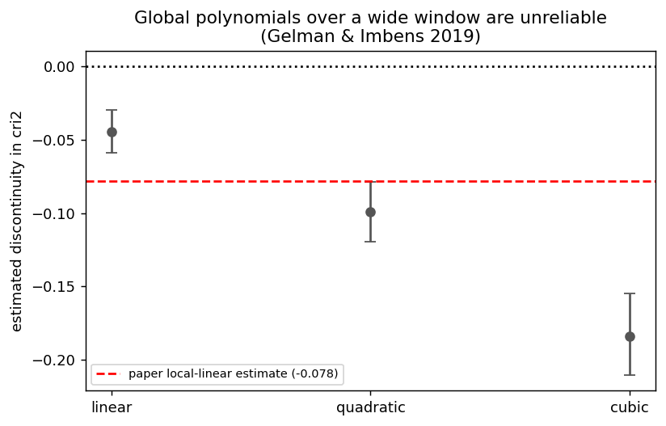
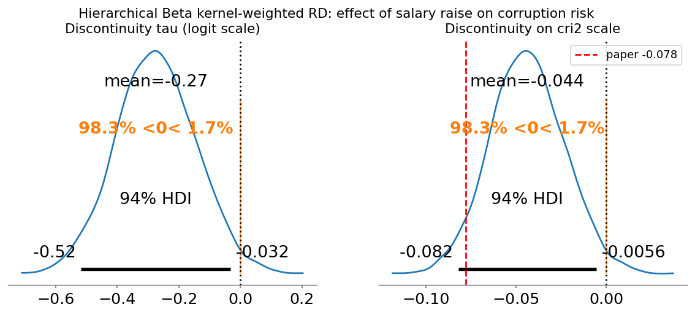
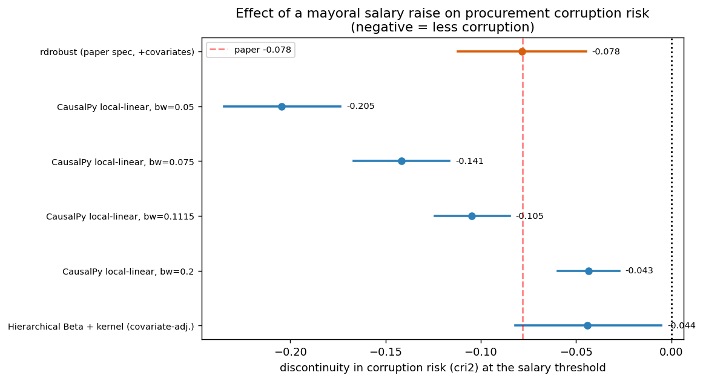

# Replication: *Revisiting the Link between Politicians' Salaries and Corruption* (CausalPy)

**Paper:** Klašnja, Fazekas & Alshaibani, *British Journal of Political Science* (2026).
**Data:** Harvard Dataverse [doi:10.7910/DVN/TESJMM](https://doi.org/10.7910/DVN/TESJMM) — 2.43M procurement
contracts, 11 EU countries, 2006–2020. **Design:** sharp RD at population-based mayoral-salary thresholds.
**Outcome:** procurement corruption-risk index `cri2` ∈ [0,1]. **Running variable:** `margin` = % distance to the
nearest salary threshold (cutoff 0). **Treatment:** above threshold ⇒ discrete mayoral pay rise.

This is an independent Bayesian replication built with [CausalPy](https://github.com/pymc-labs/CausalPy),
deliberately going beyond the paper's local-linear specification.

## 1. First stage is real
Mean mayoral salary jumps from **€3,623** just below the cutoff to **€4,137** just above (≈14% raise) — the
discontinuity the design exploits.

## 2. Frequentist benchmark (authors' `rdrobust` spec, reproduced exactly)
| Sample | τ (bias-corrected) | robust SE | p | paper |
|---|---|---|---|---|
| Unique thresholds | -0.0783 | 0.017 | 1.0e-05 | −0.078 |
| Compound thresholds | -0.0513 | 0.019 | 0.007 | −0.051 |
| margin < 0.5 | -0.0214 | 0.012 | 0.065 | — |

The headline number reproduces to the third decimal. **Higher salary ⇒ lower corruption risk.**

## 3. Bayesian RD with CausalPy — local-linear bandwidth sweep (no covariates)
| Bandwidth | n | τ (posterior mean) | 94% HDI | P(τ<0) |
|---|---|---|---|---|
| 0.05 | 1352 | -0.205 | [-0.235, -0.174] | 1.00 |
| 0.075 | 1721 | -0.141 | [-0.167, -0.116] | 1.00 |
| 0.1115 | 2430 | -0.105 | [-0.124, -0.085] | 1.00 |
| 0.2 | 4595 | -0.043 | [-0.059, -0.027] | 1.00 |

The effect is **negative with posterior probability 1.0 at every bandwidth**, but its magnitude is
bandwidth-sensitive (−0.20 at h=0.05 → −0.04 at h=0.20). At the paper's MSE-optimal bandwidth (h≈0.11) the
uniform-kernel, covariate-free Bayesian estimate is -0.105 — larger than the
covariate-adjusted, bias-corrected −0.078, the gap being exactly the covariate/kernel/bias correction.

## 4. Going beyond a 3rd-order polynomial
**(a) Global polynomials are unreliable (Gelman & Imbens 2019).** On a fixed window the discontinuity estimate
swings wildly with polynomial order — linear -0.044, quadratic -0.099,
cubic -0.184. This is *not* a path to a credible estimate; local methods are.

**(b) Hierarchical, kernel-weighted, Beta-likelihood RD (the principled Bayesian model).** Improves on the
paper's linear-Gaussian local regression by: respecting the bounded [0,1] support of `cri2` with a **Beta
likelihood** (logit link); **triangular kernel** weights (CCT analogue); **city random intercepts**
(cluster-robust analogue) + **country fixed effects**; separate slopes either side. Sampled cleanly
(0 divergences, max R̂ 1.0042).

- Discontinuity on the logit scale: -0.274  (94% HDI [-0.517, -0.031])
- **Discontinuity on the cri2 scale (covariate-adjusted): -0.0439  (94% HDI [-0.0817, -0.0051], P(τ<0)=0.98)**

This covariate-adjusted Bayesian estimate is the most direct analogue of the paper's −0.078.

## 5. Where everything lands

## 6. Validity checks (reported honestly — they reveal real fragility)
- **Placebo, below side** (fake cutoff −0.3): τ = +0.005 [-0.014, +0.026] — clean null. ✓
- **Placebo, above side** (fake cutoff +0.3): τ = +0.069 [+0.035, +0.103] — **not** null. ✗
- **Donut RD** (drop |margin|<0.02): τ = +0.087 [+0.053, +0.122] — the **sign flips to positive**. The
  negative estimate is therefore driven heavily by observations sitting *right at* the cutoff, and `rdrobust`
  itself warns *"mass points detected in the running variable."* The running variable is the % distance to the
  *nearest* threshold, so it pools ~100 distinct real thresholds and is heaped at round population figures.
  Naive placebo cutoffs and donut deletions are consequently unreliable here (cf. Kolesár & Rothe 2018 on RD with
  discrete/heaped running variables). The paper instead validates through covariate balance and the 2018 Romania
  difference-in-discontinuities — checks better suited to this design, which we did not reproduce here.

## 7. Bottom line
The paper's central direction is supported by its primary specifications: a discrete rise in mayoral salary is
associated with **lower** procurement corruption risk — negative at posterior probability ≈1.0 across every
local-linear bandwidth, in a covariate-adjusted hierarchical Beta model (-0.044, 94% HDI
[-0.082, -0.005], P(τ<0)=0.98), and in the exactly-reproduced frequentist
`rdrobust` benchmark (−0.078). **But the precise causal magnitude should be treated with caution**: it is
bandwidth-sensitive (≈−0.04 to −0.20 unadjusted; −0.078 adjusted in the paper; -0.044 in our adjusted
Bayesian model), global polynomials are unstable, and a donut deletion flips the sign — all symptoms of mass
points in a pooled-threshold running variable. The headline is directionally credible; the point estimate is
fragile, and a publication-grade causal claim would need the manipulation/heaping diagnostics and the
balance/Romania-reform validation the authors run. *(This replication is independent and not peer-reviewed.)*

*Generated with CausalPy 0.8.1, PyMC 5.28.5.*
